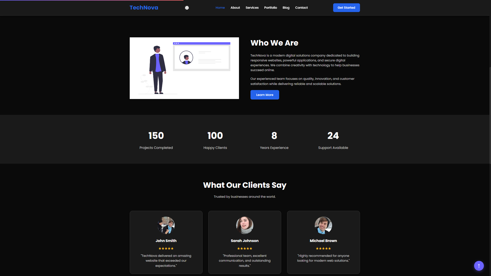
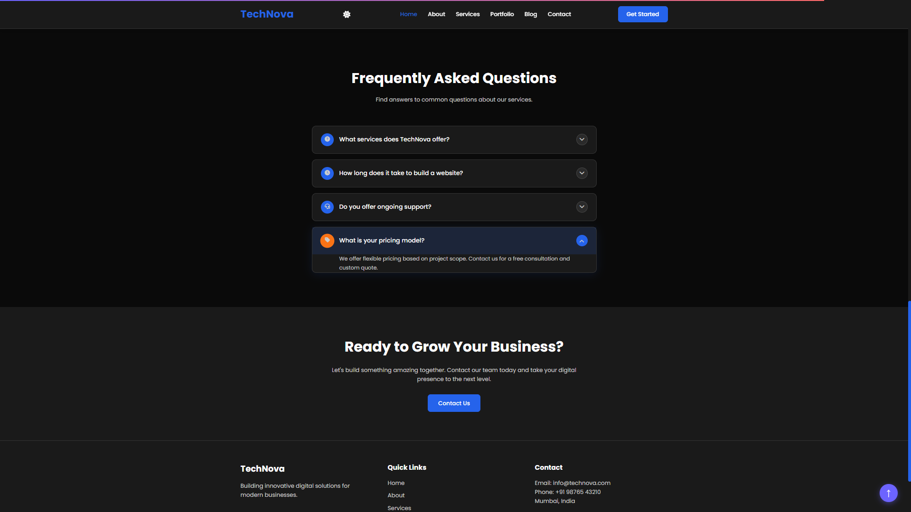
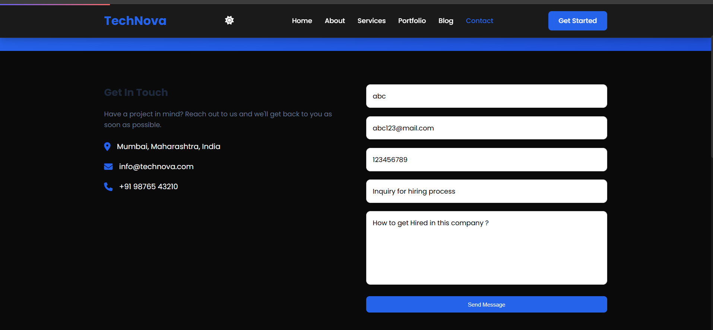
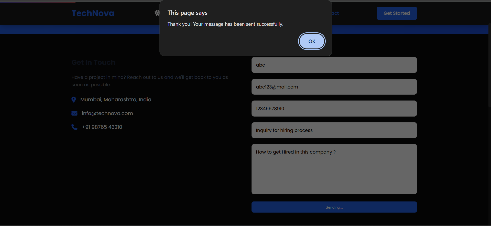
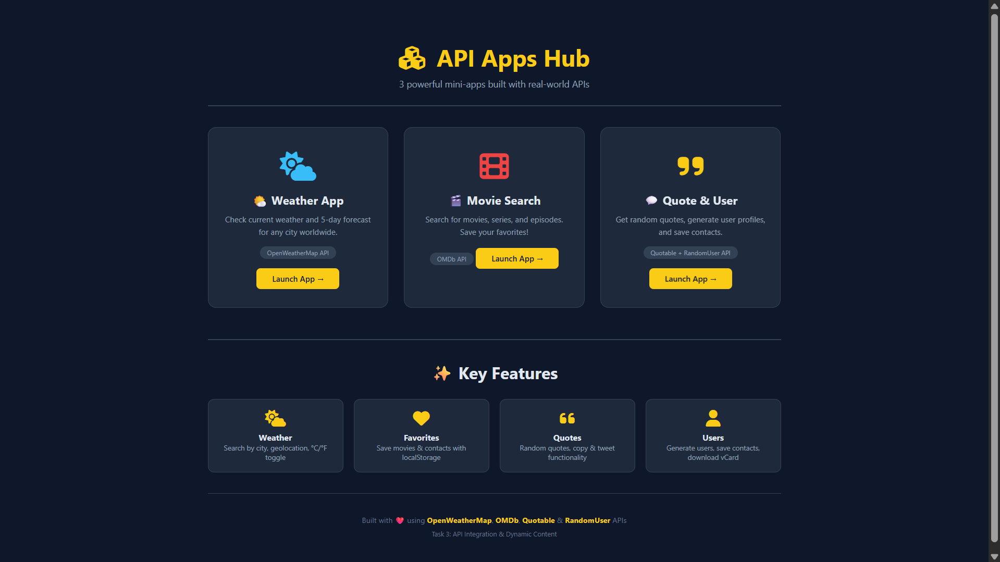
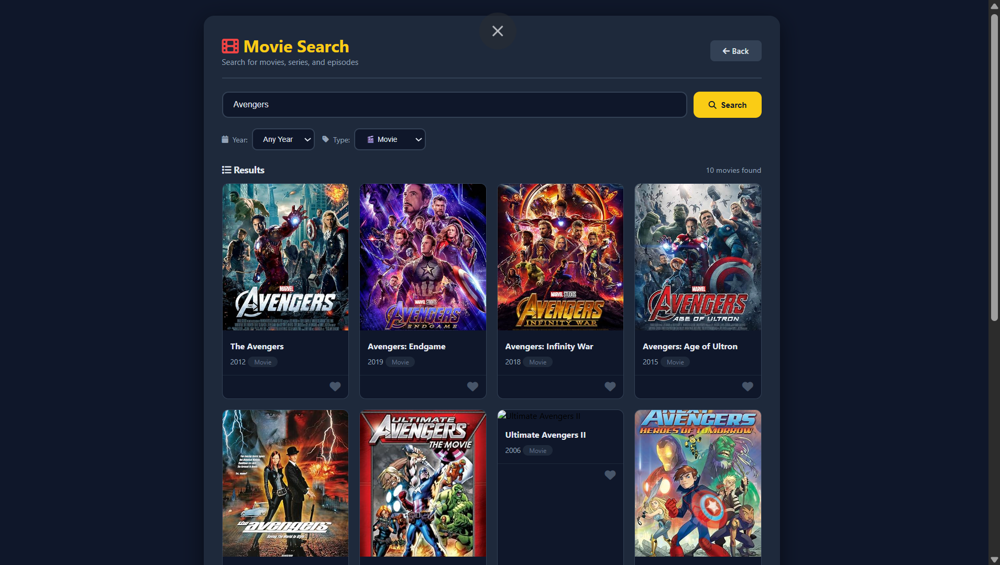

# 🚀 ApexPlanet Web Developer Internship


---

## 📌 Overview

This repository contains all the projects completed during my **ApexPlanet Web Development Internship**.

Throughout the internship, I completed **five progressive tasks**, beginning with responsive web design and advancing to JavaScript interactivity, REST API integration, CRUD application development, performance optimization, testing, documentation, and deployment.

Each task builds upon the previous one to demonstrate practical frontend development skills using modern web technologies.

---

## 🔗 Project Links

| Resource | Link |
|----------|------|
| 📂 Repository | https://github.com/ranejai954/apexplanet-web-developer-internship |
| 🌐 Live Demo | https://apexplanet-web-developer-internship.vercel.app |
| 💼 LinkedIn Post | https://www.linkedin.com/posts/jai-rane-62ba58352_webdevelopment-testing-deployment-ugcPost-7488186538288295936-TWgY/ |
| 🎥 Demo Video | Coming Soon |

---

# 📁 Repository Structure

```text
apexplanet-web-developer-internship/
│
├── Task-1/
├── Task-2/
├── Task-3/
├── Task-4/
├── Task-5/
│
├── screenshots/
│
└── README.md
```

---

# 📚 Task Breakdown

## 🌐 Task 1 – Responsive Website

### Objective
Build a fully responsive business website using HTML and CSS.

### Technologies
- HTML5
- CSS3
- Flexbox
- CSS Grid

### Features
- Responsive Layout
- Hero Section
- About Section
- Services
- Portfolio
- Blog
- Contact Form
- Mobile Friendly Design

**Status:** ✅ Completed

---

## ⚡ Task 2 – JavaScript Interactivity

### Objective
Enhance the website using JavaScript.

### Features
- Dark Mode
- Hamburger Navigation
- Sticky Navbar
- Scroll Progress Bar
- Back to Top Button
- Portfolio Slider
- FAQ Accordion
- Animated Counters
- Contact Form Validation

**Status:** ✅ Completed

---

## 🌐 Task 3 – API Integration

### Objective
Develop mini web applications using real-world REST APIs.

### Applications

#### 🌤️ Weather App
- Current Weather
- 5-Day Forecast
- Geolocation Support

#### 🎬 Movie Search
- Search Movies
- Filter Results
- Save Favorites

#### 💬 Quote & User Generator
- Random Quotes
- Copy Quote
- Tweet Quote
- Random User Profiles
- Save Contact (vCard)

**Status:** ✅ Completed

---

## 💰 Task 4 – Expense Tracker

### Objective
Develop a complete CRUD application with data visualization.

### Features

- Add Transactions
- Edit Transactions
- Delete Transactions
- Income & Expense Tracking
- Doughnut Chart
- Search
- Filters
- Debouncing
- Throttling
- Infinite Scrolling
- Keyboard Shortcuts
- Local Storage

**Status:** ✅ Completed

---

## 🚀 Task 5 – Final Testing & Deployment

### Objective

Finalize, optimize, document, and deploy the complete internship project.

### Activities

- Cross Browser Testing
- Mobile Responsive Testing
- Performance Optimization
- Documentation
- GitHub Repository Cleanup
- Deployment on Vercel
- Portfolio Presentation

**Status:** ✅ Completed

---

# 🛠️ Tech Stack

| Category | Technologies |
|----------|--------------|
| Frontend | HTML5, CSS3, JavaScript (ES6+) |
| APIs | OpenWeatherMap, OMDb, Quotable, RandomUser |
| Libraries | Chart.js, Font Awesome |
| Storage | localStorage, sessionStorage |
| Version Control | Git, GitHub |
| Deployment | Vercel |

---

# 📸 Project Screenshots

## 🏠 Main Hub


---

## 📄 Task 1

### Homepage


### Features


---

## ⚡ Task 2

### Animated Counter



### FAQ Accordion



### Portfolio Slider


### Contact Form



### Form Success



---

## 🌐 Task 3

### API Hub



### Weather App


### Movie Search



### Quote Generator


---

## 💰 Task 4

### Dashboard


### Transactions


### Empty State


### Food Category


### Transport Category


### Entertainment Category


---

## 📱 Mobile Responsive


---

# 📊 Repository Statistics

| Metric | Value |
|---------|------:|
| Tasks Completed | 5 |
| Technologies Used | 10+ |
| APIs Integrated | 4 |
| JavaScript Features | 15+ |
| Responsive Projects | 5 |

---

# 🚀 Getting Started

## Clone the Repository

```bash
git clone https://github.com/ranejai954/apexplanet-web-developer-internship.git
```

Navigate to any task.

Example:

```bash
cd apexplanet-web-developer-internship/Task-4
```

Open the project using **Live Server** in Visual Studio Code or simply open the `index.html` file in your browser.

---

# 🎯 Skills Gained

- Responsive Web Design
- HTML5 & CSS3
- JavaScript (ES6+)
- DOM Manipulation
- REST APIs
- Fetch API
- Async/Await
- CRUD Operations
- localStorage
- Chart.js
- Debouncing
- Throttling
- Infinite Scrolling
- Git & GitHub
- Deployment with Vercel
- Technical Documentation

---

# 👨‍💻 Author

**Jai Rane**

Full Stack Web Developer Intern

[](https://github.com/ranejai954)

[](https://www.linkedin.com/in/jai-rane-62ba58352/)

---

# 🙏 Acknowledgements

Special thanks to:

- ApexPlanet Software Pvt. Ltd.
- OpenWeatherMap API
- OMDb API
- Quotable API
- RandomUser API
- Chart.js
- Font Awesome
- Vercel

---

# 📄 License

This repository was created for educational and internship purposes.

---

<div align="center">

### ⭐ If you found this repository helpful, consider giving it a Star!

Thank you for visiting. Happy Coding! 🚀

</div>
