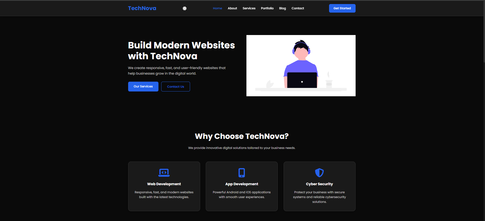
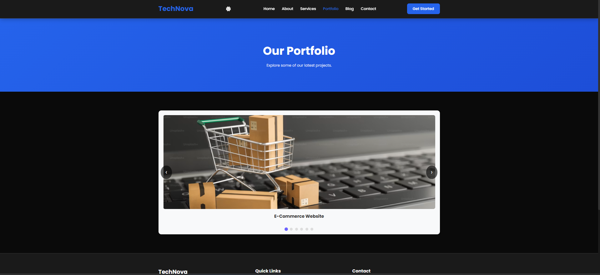
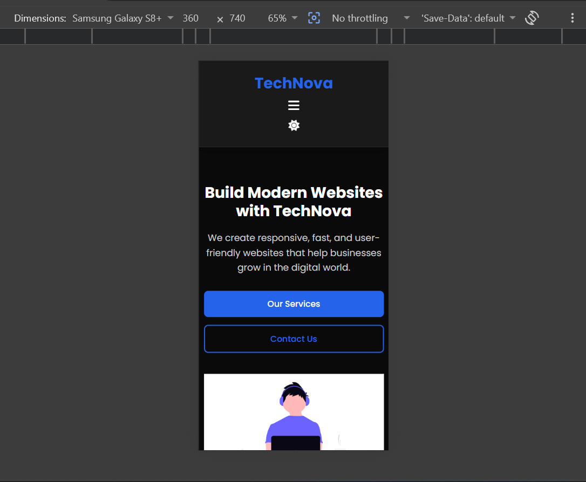

# 🚀 TechNova - Interactive Portfolio Website (Task 2)

Task 2 of the ApexPlanet Full Stack Web Development Internship.

This project extends the Task 1 responsive portfolio by adding JavaScript-powered interactive components including Dark Mode, Sticky Navigation, Image Slider, FAQ Accordion, Animated Counters, Smooth Scrolling, Form Validation, Scroll Animations, and more.

---

## 📌 Features

### HTML5
- Semantic HTML
- Multi-page website
- Responsive layout

### CSS3
- Modern UI
- Mobile-first design
- Hover effects
- Animations
- Dark Theme Support

### JavaScript
- 🌙 Dark / Light Mode Toggle
- 📌 Sticky Navigation Bar
- 🔢 Animated Counter
- 🖼️ Automatic Image Slider
- ❓ FAQ Accordion
- 📝 Contact Form Validation
- 🚀 Scroll Fade Animation
- ⬆️ Back To Top Button
- 🎯 Smooth Scrolling

---

# 📂 Folder Structure

```
Task-2/
│
├── css/
│     style.css
│     responsive.css
│
├── js/
│     main.js
│     slider.js
│     counter.js
│     validation.js
│
├── images/
│
├── screenshots/
│
├── index.html
├── about.html
├── services.html
├── portfolio.html
├── blog.html
├── contact.html
└── README.md
```

---

# 📸 Project Screenshots

## 🏠 Home Page



---

## 🔢 Animated Counter


---

## ❓ FAQ Accordion


---

## 🖼️ JavaScript Portfolio Slider



---

## 📱 Mobile Responsive Layout



---

## 📝 Contact Form Validation


---

## ✅ Successful Form Submission


---

# 🛠️ Technologies Used

- HTML5
- CSS3
- JavaScript (Vanilla JS)
- Font Awesome
- Google Fonts

---

# 🎯 Interactive Components

- Sticky Navigation
- Theme Switcher
- Image Slider
- FAQ Accordion
- Animated Statistics Counter
- Smooth Scroll
- Scroll Reveal Animation
- Contact Form Validation
- Back To Top Button

---

# 🚀 Live Demo

GitHub Pages:

https://ranejai954.github.io/apexplanet-web-developer-internship/Task-2/

---

# 📂 GitHub Repository

https://github.com/ranejai954/apexplanet-web-developer-internship/tree/main/Task-2

---

# 👨‍💻 Author

Jai Rane

B.Sc Computer Science Student

ApexPlanet Full Stack Web Development Internship
