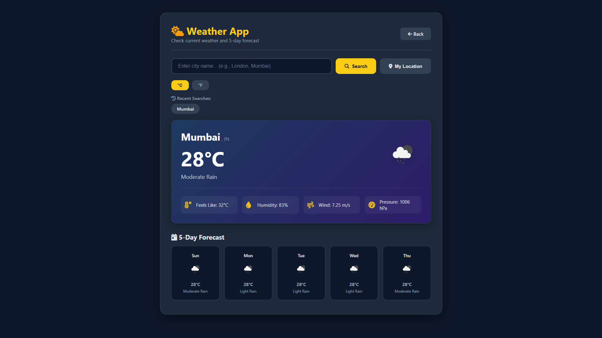

# 🌐 Task 3: API Integration & Dynamic Content

## 📌 Project Overview

This project is the third task of the ApexPlanet Full Stack Web Development Internship.

It combines three interactive JavaScript mini applications that consume real-world REST APIs. The project demonstrates asynchronous programming using Fetch API, async/await, DOM manipulation, local storage, and API integration.

### 🔗 GitHub Repository

https://github.com/ranejai954/apexplanet-web-developer-internship/tree/main/Task-3

---

# 🚀 Live Demo

> Open the project using **VS Code Live Server** or any local server to run API requests successfully.

---

# 📱 Applications Included

## 🌤️ Weather App

Search weather information for any city worldwide.

| Feature | Description |
|----------|-------------|
| API | OpenWeatherMap API |
| Search | Search weather using city name |
| Geolocation | Current location weather |
| Unit Toggle | Celsius / Fahrenheit |
| Forecast | 5-Day Forecast |
| Recent Searches | Stored using Local Storage |

### Screenshot



---

## 🎬 Movie Search App

Search movies, TV shows and episodes.

| Feature | Description |
|----------|-------------|
| API | OMDb API |
| Search | Movie title search |
| Filters | Year & Type |
| Favorites | Saved in Local Storage |
| Modal | Detailed Information |
| IMDb | Direct IMDb Link |

### Screenshot


---

## 💬 Quote Generator & Random User

Generate inspirational quotes and random user profiles.

| Feature | Description |
|----------|-------------|
| Quote API | Quotable API |
| User API | RandomUser API |
| Copy Quote | Clipboard API |
| Tweet Quote | Twitter Sharing |
| Save Contacts | Local Storage |
| vCard Download | Contact Export |

### Screenshot


---

# 🛠️ Technologies Used

| Technology | Purpose |
|------------|---------|
| HTML5 | Structure |
| CSS3 | Styling |
| JavaScript ES6 | Logic |
| Fetch API | API Requests |
| Async / Await | Asynchronous Programming |
| Font Awesome | Icons |
| OpenWeatherMap API | Weather Data |
| OMDb API | Movie Data |
| Quotable API | Quotes |
| RandomUser API | User Profiles |

---

# 📂 Project Structure

```
Task-3/
│
├── index.html
├── weather.html
├── movies.html
├── quotes.html
├── learn.html
│
├── css/
│   └── style.css
│
├── js/
│   ├── config.js
│   ├── config.sample.js
│   ├── weather.js
│   ├── movies.js
│   ├── quotes.js
│   ├── randomuser.js
│   └── learn.js
│
├── screenshots/
│
├── .gitignore
└── README.md
```

---

# 🔐 API Keys Setup

## Required APIs

| API | Website | Key |
|-----|----------|-----|
| OpenWeatherMap | https://openweathermap.org/api | Required |
| OMDb | https://www.omdbapi.com/apikey.aspx | Required |
| Quotable | https://api.quotable.io | Not Required |
| RandomUser | https://randomuser.me | Not Required |

---

## Create `config.js`

Copy

```
config.sample.js
```

to

```
config.js
```

Add your keys:

```javascript
const CONFIG = {
    WEATHER_API_KEY: "YOUR_OPENWEATHER_API_KEY",
    MOVIE_API_KEY: "YOUR_OMDB_API_KEY"
};

window.CONFIG = CONFIG;
```

> **Do not upload `config.js` to GitHub.**

---

# ▶️ Running the Project

### Live Server

Right-click

```
index.html
```

Choose

```
Open with Live Server
```

---

### Python

```bash
python -m http.server 8000
```

---

### Node

```bash
npx serve
```

---

# 🧪 Testing

## Weather App

- Search City
- Use Current Location
- Switch °C / °F
- View Forecast

---

## Movie App

- Search Movies
- Filter Results
- Open Details
- Add Favorites

---

## Quote Generator

- Generate Quote
- Copy Quote
- Tweet Quote

---

## Random User

- Generate User
- Save Contact
- Download vCard

---

# 📊 Features Completed

| Module | Status |
|----------|--------|
| Weather API | ✅ |
| Movie API | ✅ |
| Quote API | ✅ |
| Random User API | ✅ |
| Async JavaScript | ✅ |
| Local Storage | ✅ |
| Responsive Design | ✅ |

---

# 📚 Learning Outcomes

- Fetch API
- Async / Await
- Promise Handling
- JSON Parsing
- DOM Manipulation
- Error Handling
- Local Storage
- API Security
- REST APIs

---

# 📸 Screenshots

## 🏠 Main Hub


---

## 🌤️ Weather App


---

## 🎬 Movie App


---

## 💬 Quote Generator


---

# 🏆 Internship Progress

| Task | Status |
|------|--------|
| Task 1 | ✅ Completed |
| Task 2 | ✅ Completed |
| **Task 3** | ✅ Completed |
| Task 4 | ⏳ Upcoming |
| Task 5 | ⏳ Upcoming |

---

# 🚀 Next Steps

- Record Demo Video
- Publish GitHub Repository
- Share LinkedIn Post
- Continue with Task 4

---

# 👨‍💻 Author

**Jai Rane**

B.Sc. Computer Science Student

ApexPlanet Full Stack Web Development Intern

### GitHub

https://github.com/ranejai954

### LinkedIn

https://www.linkedin.com/in/jai-rane-62ba58352/

---

# 🙏 Acknowledgements

- OpenWeatherMap
- OMDb API
- Quotable API
- RandomUser API
- Font Awesome

---

# 📄 License

This project is created for educational and internship purposes.

---

# ❤️ Built During

**ApexPlanet Full Stack Web Development Internship**

---

# 🔗 Quick Links

- Home → `index.html`
- Weather → `weather.html`
- Movies → `movies.html`
- Quotes → `quotes.html`
