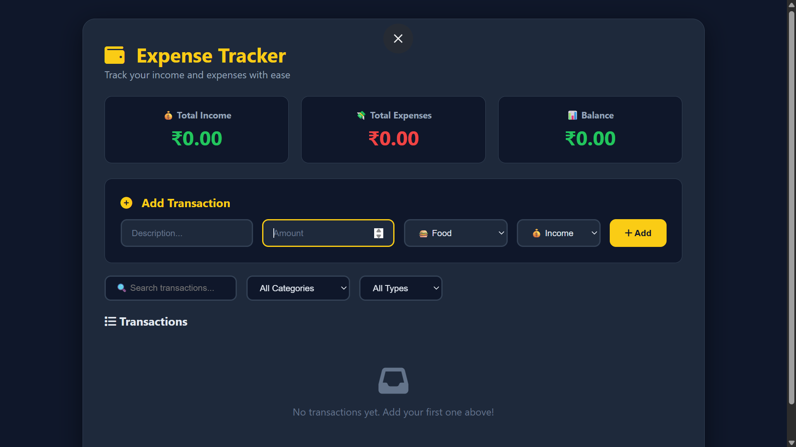
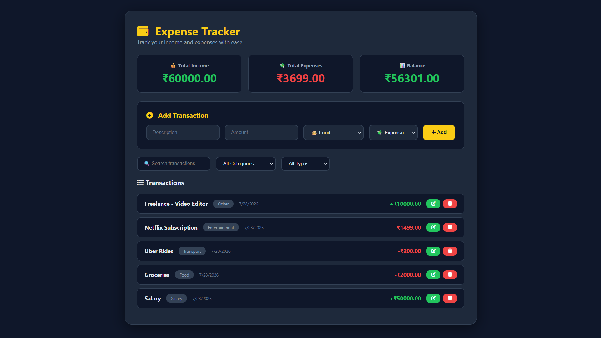

# 💰 Expense Tracker - Full CRUD Application

## 📌 Project Overview
A fully functional Expense Tracker application built with vanilla JavaScript. This app allows users to manage their income and expenses with full CRUD (Create, Read, Update, Delete) operations, data persistence using localStorage, and advanced JavaScript features like debouncing, throttling, and keyboard navigation.

**Live Demo:** [View Project](#)  
**GitHub Repository:** [Link to your repo]

---

## 📸 Screenshots

### Empty State

*Initial state when no transactions exist*

### With Sample Data

*Application with income and expense entries*

---

## 🚀 Features

### Core Features
| Feature | Description |
|---------|-------------|
| ✅ **Add Transactions** | Add income or expense with description, amount, category, and type |
| ✅ **View Transactions** | All transactions displayed in a clean list |
| ✅ **Edit Transactions** | Modify any existing transaction |
| ✅ **Delete Transactions** | Remove transactions with confirmation |
| ✅ **Real-time Stats** | Income, Expense, and Balance update automatically |
| ✅ **localStorage** | All data persists after page refresh |

### Advanced JavaScript Features
| Feature | Description |
|---------|-------------|
| ✅ **Debouncing** | Search input optimization (300ms delay) |
| ✅ **Throttling** | Scroll event optimization (500ms limit) |
| ✅ **Keyboard Navigation** | Enter to submit, Escape to clear form |
| ✅ **Infinite Scroll** | Load more transactions as you scroll |

### UI/UX Features
| Feature | Description |
|---------|-------------|
| ✅ **Dark Theme** | Modern dark UI design |
| ✅ **Responsive** | Works on desktop, tablet, and mobile |
| ✅ **Category Tags** | Color-coded transaction categories |
| ✅ **Search & Filter** | Search by description, filter by category/type |

---

## 🛠️ Technologies Used

| Technology | Purpose |
|------------|---------|
| **HTML5** | Semantic structure |
| **CSS3** | Dark theme, Flexbox, Grid, Animations |
| **JavaScript (ES6+)** | CRUD logic, DOM manipulation, advanced features |
| **localStorage** | Data persistence |
| **Font Awesome 6** | Icons for better UX |

---

## 📁 Project Structure
Task-4/
│
├── index.html
├── css/
│   └── style.css
├── js/
│   └── app.js
├── screenshots
└── README.md