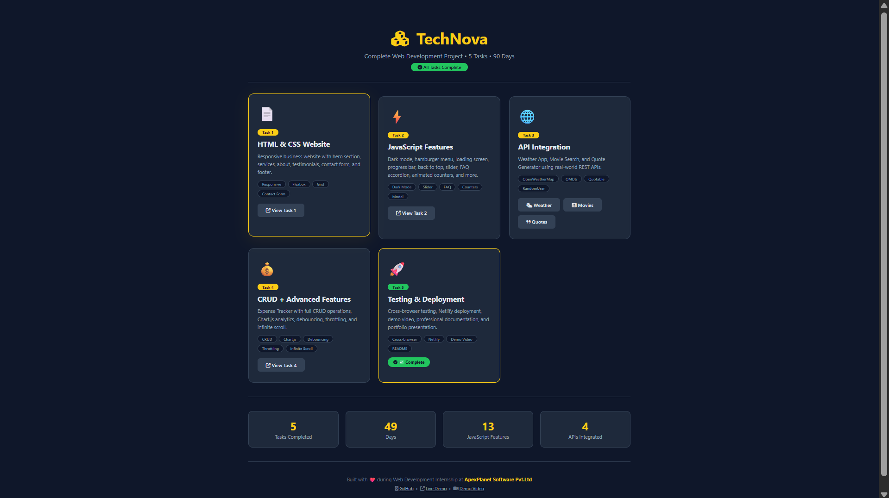
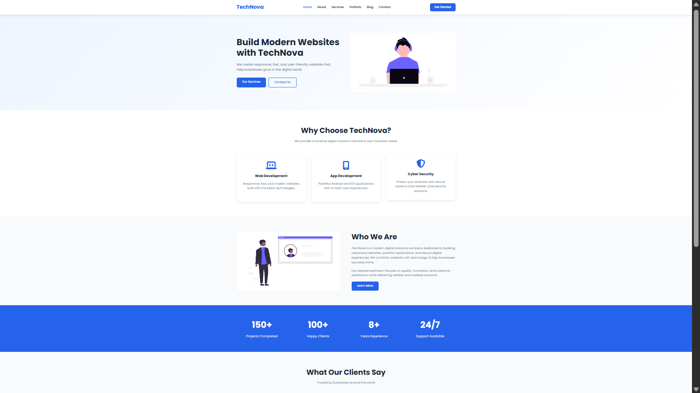
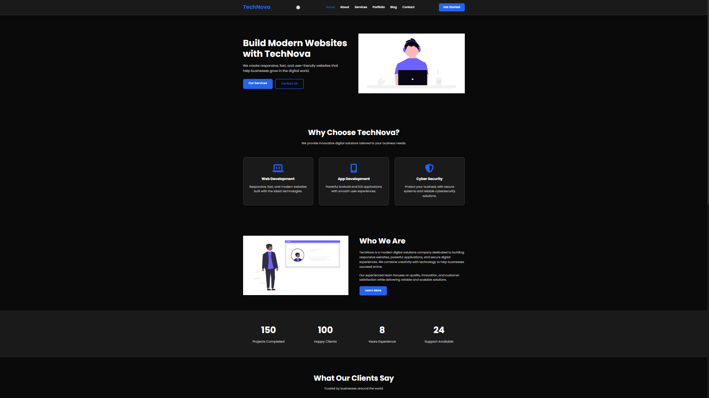
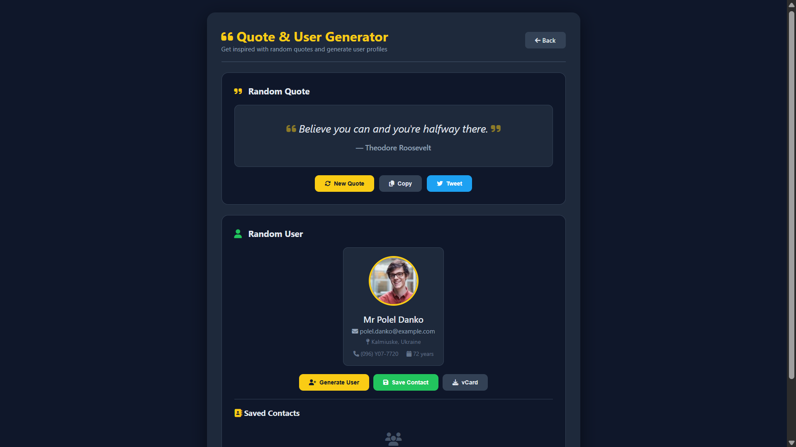

# 🚀 Task 5: Testing, Deployment & Professional Presentation

## 📌 Objective

**Task 5** is the final capstone of the **ApexPlanet Full Stack Web Developer Internship**. This task focuses on testing, deployment, documentation, and presenting the complete internship project in a professional manner.

| Resource | Link |
|----------|------|
| 🌐 Live Demo | **Add Your Deployment URL** |
| 💻 Main Repository | https://github.com/ranejai954/apexplanet-web-developer-internship |
| 🎥 Demo Video | **Add Your YouTube Video Link** |
| 💼 LinkedIn Post | **Add Your LinkedIn Post Link** |

---

# 🎯 Task Overview

Task 5 concludes the internship by combining everything built throughout the previous tasks into one complete project.

The main objectives include:

- ✅ Cross-browser testing
- ✅ Mobile responsiveness testing
- ✅ Bug fixing and optimization
- ✅ Professional documentation
- ✅ GitHub repository organization
- ✅ Live deployment
- ✅ Portfolio-ready presentation

---

# 🧪 Testing Performed

### 🌐 Cross Browser Testing

Successfully tested on:

- Google Chrome
- Microsoft Edge
- Mozilla Firefox
- Safari

---

### 📱 Responsive Testing

Verified layouts on:

- Desktop
- Laptop
- Tablet
- Mobile

---

### ✅ Functional Testing

Verified the following features:

- Navigation
- Contact Forms
- Dark Mode
- API Requests
- Search Filters
- CRUD Operations
- Local Storage
- Responsive Navigation
- Buttons & Modals

---

### 🧹 Code Quality

Completed the following improvements:

- Removed unused code
- Removed debugging statements
- Improved folder structure
- Optimized JavaScript
- Cleaned CSS
- Organized assets

---

# 🚀 Deployment

The project has been prepared for deployment using **Vercel**.

Deployment includes:

- Automatic GitHub deployment
- Production build
- Responsive testing
- Final optimization

---

# 🎬 Project Demonstration

A complete walkthrough video includes:

- Project Introduction
- Task 1 Website
- Task 2 JavaScript Features
- Task 3 API Applications
- Task 4 Expense Tracker
- Mobile Responsive View
- Testing Results
- Final Deployment

---

# 📸 Project Screenshots

## 🏠 Main Hub



Complete dashboard containing all internship tasks.

---

## 📄 Task 1 — HTML & CSS Website

### Light Theme



Responsive business landing page.

### Dark Theme



Dark mode implementation with JavaScript.

---

## 🌐 Task 3 — API Apps Hub


Central hub containing all API-powered applications.

---

## 🌤 Weather Application


Features:

- Current Weather
- 5-Day Forecast
- Search by City
- Geolocation Support
- Celsius/Fahrenheit Toggle

Powered by **OpenWeatherMap API**.

---

## 🎬 Movie Search Application


Features:

- Movie Search
- Year Filter
- Type Filter
- Favorites
- Local Storage

Powered by **OMDb API**.

---

## 💬 Quote & User Generator



Features:

- Random Quotes
- Copy Quote
- Tweet Quote
- Random User Generator
- Save Contacts
- Download vCard

Powered by:

- Quotable API
- RandomUser API

---

## 💰 Expense Tracker


Features:

- Add Transaction
- Edit Transaction
- Delete Transaction
- Income & Expense Tracking
- Balance Calculation
- Search Transactions
- Filters
- Local Storage
- Chart.js Analytics

---

# 🛠 Technologies Used

| Category | Technologies |
|-----------|--------------|
| Frontend | HTML5, CSS3, JavaScript (ES6+) |
| APIs | OpenWeatherMap, OMDb, Quotable, RandomUser |
| Charts | Chart.js |
| Icons | Font Awesome |
| Storage | localStorage, sessionStorage |
| Testing | Chrome DevTools, Lighthouse |
| Deployment | Vercel |
| Version Control | Git & GitHub |

---

# 📁 Folder Structure

```text
Task-5/
│
├── index.html
├── README.md
├── .gitignore
├── .env.example
│
├── T1/
│
├── T2/
│
├── T3/
│
├── T4/
│
└── screenshots/
    ├── main-home-screen.png
    ├── technova-v1.png
    ├── technova-v2.png
    ├── main-hub.png
    ├── weather-app.png
    ├── movie-app.png
    ├── quotes-user-app.png
    └── with-transactions.png
```

---

# 🚀 Running the Project

## Clone Repository

```bash
git clone https://github.com/ranejai954/apexplanet-web-developer-internship.git
```

Move inside Task-5

```bash
cd apexplanet-web-developer-internship/Task-5
```

Run using **Live Server** in Visual Studio Code.

---

# 🔑 API Keys Required

| API | Website | Purpose |
|------|----------|----------|
| OpenWeatherMap | https://openweathermap.org/api | Weather Application |
| OMDb | https://www.omdbapi.com/apikey.aspx | Movie Search |

Create a `.env` file from `.env.example` and add your API keys before running the applications.

---

# 📊 Project Summary

| Feature | Status |
|----------|--------|
| HTML & CSS Website | ✅ |
| JavaScript Features | ✅ |
| API Integration | ✅ |
| Expense Tracker CRUD | ✅ |
| Testing | ✅ |
| Deployment | ✅ |
| Documentation | ✅ |

---

# 🏆 Internship Tasks

| Task | Description | Status |
|------|-------------|:------:|
| Task 1 | Responsive HTML & CSS Website | ✅ |
| Task 2 | JavaScript Interactivity | ✅ |
| Task 3 | API Integration | ✅ |
| Task 4 | Expense Tracker (CRUD) | ✅ |
| Task 5 | Testing, Deployment & Documentation | ✅ |

---

# 🎥 Demo Video

Replace the placeholder below with your YouTube video ID.

```md
[](https://youtu.be/YOUR_VIDEO_ID)
```

---

# 👨‍💻 Author

**Jai Rane**

Full Stack Web Developer Intern

ApexPlanet Software Pvt. Ltd.

### Connect with Me

- GitHub: https://github.com/ranejai954
- LinkedIn: **Add Your LinkedIn URL**

---

# 🙏 Acknowledgements

Special thanks to:

- ApexPlanet Software Pvt. Ltd.
- OpenWeatherMap API
- OMDb API
- Quotable API
- RandomUser API
- Chart.js
- Font Awesome
- Vercel
- Visual Studio Code

---

# 📄 License

This repository was developed as part of the **ApexPlanet Full Stack Web Developer Internship** and is intended for educational and portfolio purposes.

---

<div align="center">

### ⭐ If you found this project helpful, please consider giving it a Star!

Built with ❤️ during the **ApexPlanet Full Stack Web Developer Internship**

</div>
